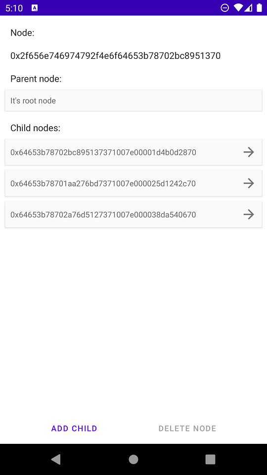

# Tree Node
Данное приложение хранит информацию в древовидной форме. При первой зпуске созается корневой элемент.
Есть возможность: добавлять дочерние узлы, удалять узлы. При удалении узла удаляются так же дочерние узлы

При реализации данного приложения использованы: паттерн CleanArchitecture, паттерн MVVM, Dagger2, LiveData, Coroutines, Room, ViewBinding
В приложении есть: светлая и темная тема, русский и английский языки